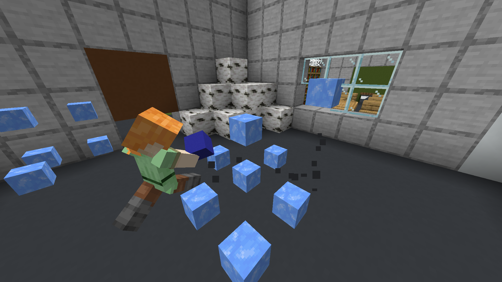
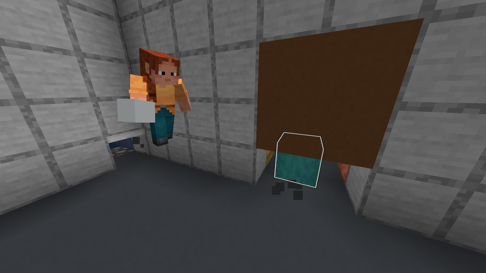
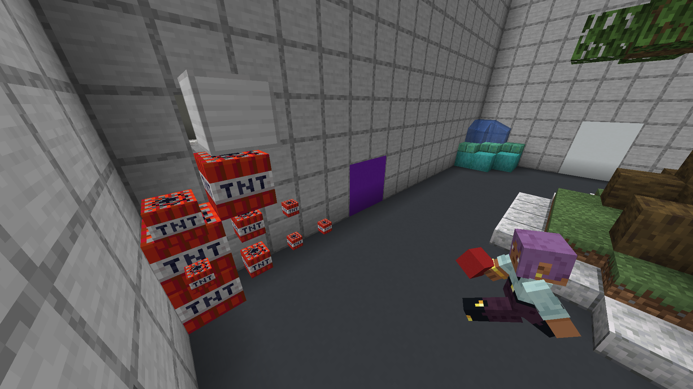

# HueHunters
A standalone game from BlueDragon: hiders disguised as blocks must avoid the hunters, who can use the colors in their inventory to bend reality and make real blocks disappear. This game is an entry to the [2024 Minestom game jam](https://hackmd.io/HwIBGm0ySw2cDfv2-UhyMw?view), and is licensed under the [Apache 2.0 license](./LICENSE).

## Gameplay

At the start, there are two teams: **hiders** and **seekers**. Each team has a special ability:
- Hiders can disguise as blocks
- Seekers can make nearby blocks disappear by holding an item that matches their color.

The seekers want to hunt down and kill the hiders before the time runs out.

If a seeker kills a hider, the hider becomes a **helper**. Helpers are as small as hiders, allowing them to fit through 1-block gaps. However, they do not have the hunter's ability to make blocks disappear. They are also unable to attack hiders, but they can "tag" them, causing them to glow for a short duration.

## Screenshots

_A seeker, holding blue to make the ice disappear, chasing a hider that was disguised in an ice pile._

_A seeker chasing a tagged hider._

_A seeker, making the nearby TNT disappear, chasing a hider disguised as an iron block._

## Building and Running

### Worlds Folder

Copy a `worlds` folder into the root of the project. This folder should contain Minecraft (Anvil) map folders.

### Gradle

Build a standalone JAR with `./gradlew build`.
It will be located at `build/libs/HueHunters-1.0-SNAPSHOT-all.jar`.

To run this, create a worlds folder as described above and run `java -jar ./build/libs/HueHunters-1.0-SNAPSHOT.jar`.

### Docker Image

First, create a worlds folder as described above. This will be embedded into the Docker image for portability.

Then, run `docker build .`.
